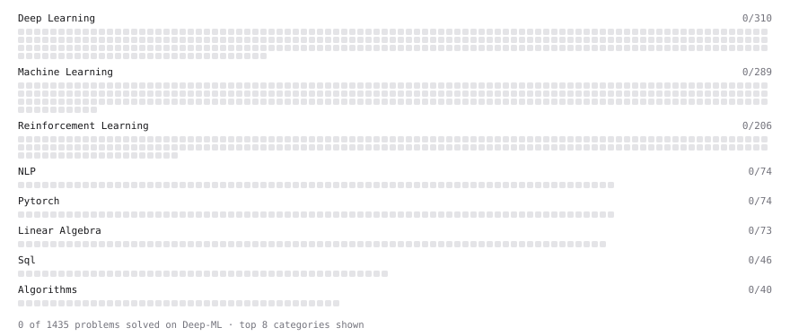

# Deep-ML

My machine learning practice from [Deep-ML](https://www.deep-ml.com). Every solution here was written by hand.

**3** solved · 0 problems · 0 labs · 3 math

[**Browse the interactive portfolio**](https://ysant77.github.io/deep-ml/) to replay this filling in over time.

## Math

| | Difficulty | Solved | |
| --- | --- | --- | --- |
| [Information Theory: Entropy](https://www.deep-ml.com/math-problems/24) | medium | 2026-09-21 | [solution](math/0024-information-theory-entropy) |
| [KL Divergence](https://www.deep-ml.com/math-problems/25) | hard | 2026-09-21 | [solution](math/0025-kl-divergence) |
| [Maximum Likelihood and MAP](https://www.deep-ml.com/math-problems/26) | hard | 2026-09-21 | [solution](math/0026-maximum-likelihood-and-map) |

---

_This file is regenerated by Deep-ML on every push._
